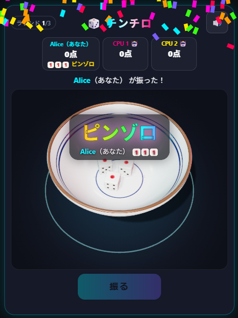
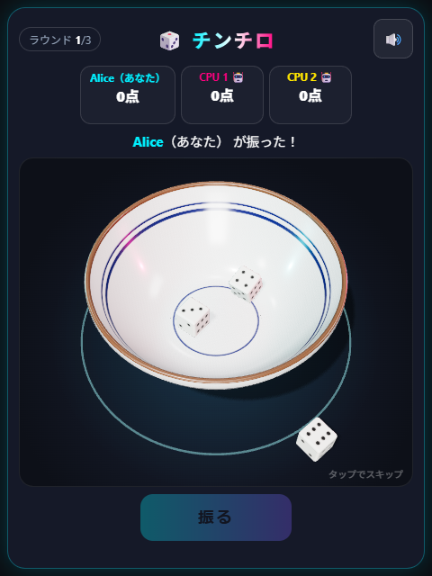
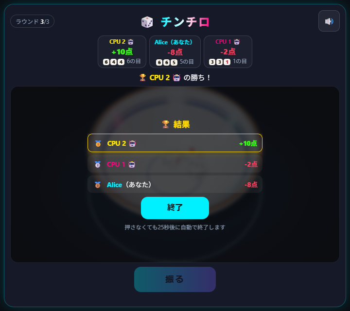

# 【遊び方】チンチロ：どんぶりにサイコロを振って役をくらべる

「**チンチロ**」は、どんぶりにサイコロを3つ振り入れて、出た目の組み合わせ（役）の強さをくらべる2〜6人用のゲームです。サイコロは3Dの物理演算で、どんぶりの中を本当に転がります。内壁に当たって跳ね、ぶつかり合いながら止まるまで、全員の画面に同じ出目が出ます。人数が足りないときはCPUが入ります。

お金や点数を賭けることはありません。点数はこの試合の中だけのものです。

## 1. ゲームの流れ

1. 試合は **3ラウンド** です。各ラウンドで、参加者が1人ずつ順番にサイコロを振ります。振る順番の先頭は、ラウンドごとに1人ずつずれます。
2. 自分の番では「振る」ボタンを押すか、どんぶりをタップしてサイコロを振ります。
3. 役が出たら、その役で自分の番は終わりです。役が出なかったとき（**目なし**）は振り直せます。3回振っても目なしなら、目なしで終わります。
4. 全員が振り終わったら、そのラウンドの勝ち負けを決めて、点数をやりとりします。

## 2. 役

上ほど強い役です。

| 役 | 出目 | 勝ったときにもらえる点（1人から） |
|---|---|---|
| ピンゾロ | 1・1・1 | 5点 |
| ゾロ目 | 2・2・2 〜 6・6・6（数が大きいほど強い） | 3点 |
| シゴロ | 4・5・6 | 2点 |
| 目 | 2つが同じ数のとき、残りの1つの数（6の目が一番強く、1の目が一番弱い） | 1点 |
| 目なし | 上のどれでもない（3回振っても役が出なかった） | 1点 |
| ションベン | サイコロがどんぶりの外に出た | 1点 |
| ヒフミ | 1・2・3 | 1点（負けたときは倍払う） |

- 目なしとションベンは同じ強さです。
- 「目」の例：3・3・5 は「5の目」、6・6・2 は「2の目」です。
- **ションベン**：振ったサイコロがどんぶりの外に飛び出すと、ションベンになり、その場で自分の番が終わります（振り直せません）。1回振るごとに、約4%の確率で起こります。
- **ヒフミ**：出た時点で番が終わります。ラウンドで負けたとき、払う点が倍になります。

## 3. 点のやりとり

ラウンドの最後に、一番強い役を出した人が、ほかの全員から点をもらいます。

- もらえる点は、**勝った人の役**で決まります（ピンゾロ5点・ゾロ目3点・シゴロ2点・それ以外1点）。
- 負けた人の中でヒフミを出した人は、**その倍**を払います。
- 一番強い役を出した人が2人以上いるときは、そのラウンドは**引き分け**で、点の移動はありません。

例：4人で、Aさんがシゴロ、Bさんが5の目、Cさんがヒフミ、Dさんが目なしのとき、Aさんの勝ちです。Bさんが2点、Cさんが4点（倍）、Dさんが2点を払い、Aさんは8点をもらいます。

## 4. 勝敗

3ラウンドが終わったとき、点数が一番高い人の勝ちです。点数が一番高い人が2人以上いるときは引き分けです。

## 5. 操作と演出

- 自分の番は、「振る」ボタンを押すか、どんぶりをタップします。20秒操作がないと、自動で振ります。
- サイコロが転がっている間にどんぶりをタップすると、転がる様子をスキップして結果を出します（自分の画面だけで、出目は変わりません）。
- サイコロがどんぶりや、ほかのサイコロに当たる音は、当たった強さに合わせて鳴ります。右上のスピーカーのボタンで、音をオン・オフできます。

## 6. 楽しみ方のコツ

- **腕も読みも関係なし**：出目は完全に運です。1回振ったときに役が出る確率は約半分で、ピンゾロは216回に1回しか出ません。
- **最後まで分からない**：ピンゾロ1回で全員から5点ずつもらえるので、最終ラウンドの最後の1人まで逆転があります。
- **配信にもおすすめ**：OBS透過モードに対応しています。背景が透けても、サイコロの影は残ります。
