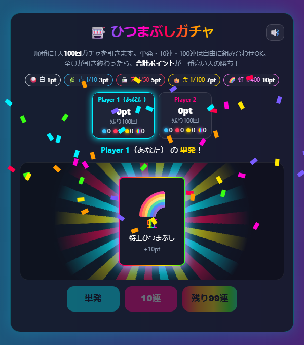
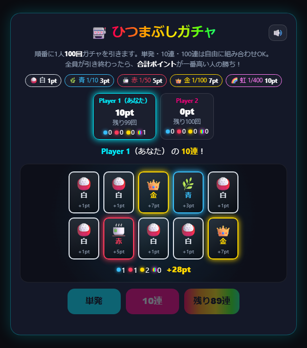
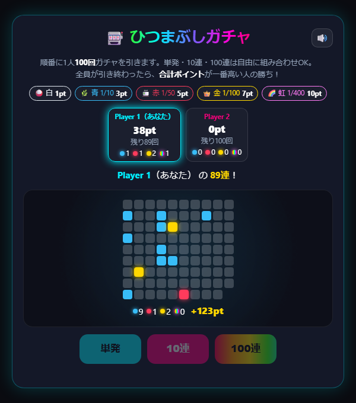
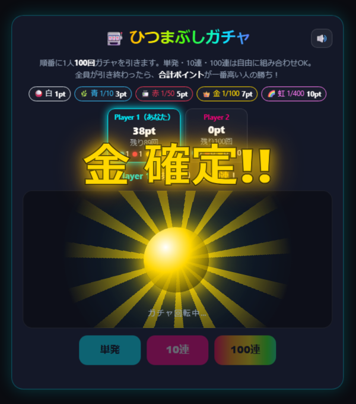
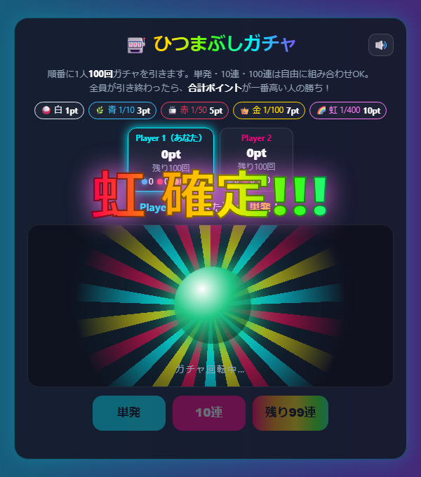

# 【遊び方】ひつまぶしガチャ：100回引いて合計ポイントを競う運だめしバトル

「**ひつまぶしガチャ**」は、順番に1人100回ずつガチャを引き、出たアイテムのポイントの合計を競う2〜6人用のゲームです。腕も読みも関係なく、勝負を決めるのは運だけ。虹が出た瞬間、画面の前の全員が盛り上がります。人数が足りないときはCPUが入ります。

お金やアイテムを使うことはありません。ガチャは何回でも無料です。

## 1. レア度とポイント

ガチャから出るアイテムには5つのレア度があります。

| レア度 | アイテム | ポイント | 出る確率 |
|---|---|---|---|
| 白 | 🍚 ごはん | 1pt | 残り（約87%） |
| 青 | 🌿 薬味 | 3pt | 1/10 |
| 赤 | 🍵 お出汁 | 5pt | 1/50 |
| 金 | 👑 うなぎ | 7pt | 1/100 |
| 虹 | 🌈 特上ひつまぶし | 10pt | 1/400 |

## 2. ゲームの流れ

1. 参加者の並び順で、1人ずつ自分のターンになります。
2. 自分のターンでは、**単発（1回）・10連・100連** のボタンでガチャを引きます。合計100回になるまで、好きな組み合わせで引けます。
   - 途中まで引いたあとは、100連のボタンが「残り◯連」に変わり、残りをまとめて引けます。
3. 100回引き終わると、次の人のターンです。ほかの人がガチャを引いている様子は、全員の画面に同じ演出で表示されます。
4. 30秒操作がないと、残りの回数を自動でまとめて引きます。

## 3. 演出

- 玉が光った色で、その回の一番いいレア度を予告します。赤以上は、途中で色が変わる「**昇格**」が起きることもあります。
- 金以上が出るときは「**金 確定!!**」「**虹 確定!!!**」の文字が出て、虹のときは画面全体が虹色に光ります。

- 演出はガチャの画面をタップするとスキップできます（自分の画面だけがスキップされ、結果は変わりません）。
- 右上のスピーカーのボタンで、効果音をオン・オフできます。

## 4. 勝敗

全員が100回ずつ引き終わったら、合計ポイントが一番高い人の勝ちです。合計ポイントが同じ人が複数いる場合は引き分けです。

100回引いたときの合計は、平均で **約136ポイント** です。1人が100回引くうちに虹が1回でも出る確率は約22%で、だいたい5人に1人は虹を引けます。

## 5. 楽しみ方のコツ

- **単発・10連・100連で結果の出方は変わりません**：どの引き方でも、1回ごとの確率は同じです。単発でじっくり、100連で一気に、と好みの演出で楽しみましょう。
- **最後まで分からない**：青の数で少しずつ差がつきますが、虹が1回出ると10ポイント入るので、最後の1人まで逆転があります。
- **配信にもおすすめ**：OBS透過モードに対応しています。虹が出た瞬間の盛り上がりを、視聴者と一緒に楽しめます。
